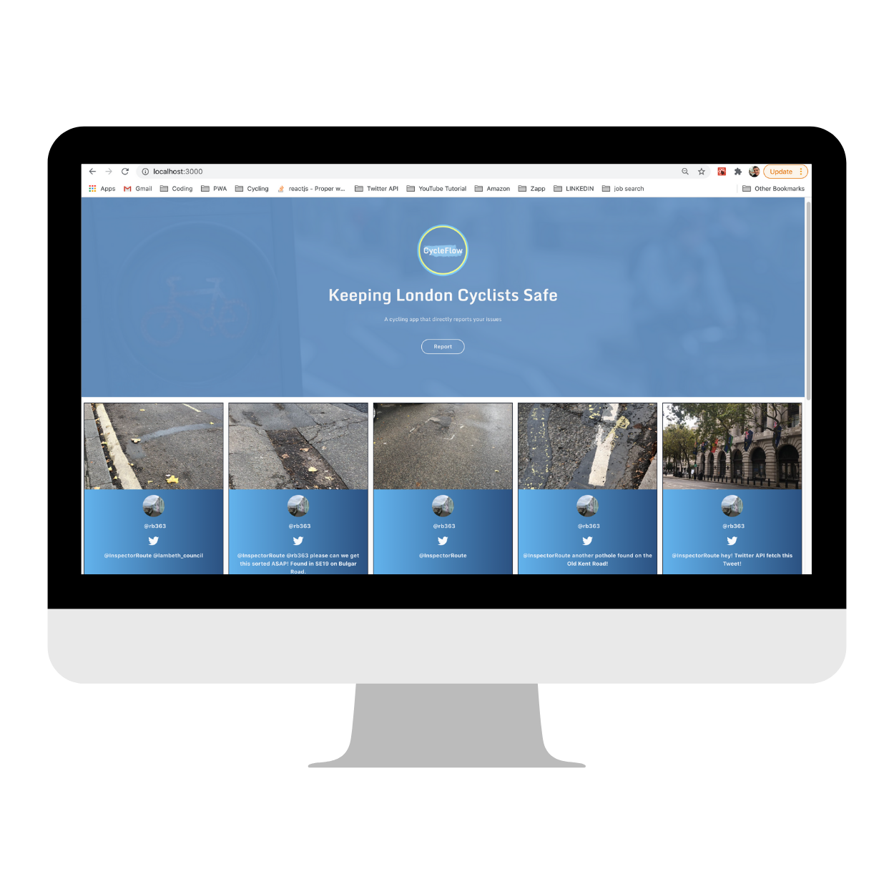

# CycleFlow

<!-- Remember to reflect any changes to the readme in the Table of Contents-->

## An app to log and flag issues seen by cyclists in London on their cycle route directly to councils. 

  

CycleFlow utilises the Twitter API to allow users to centrally log any issues seen on their route. By directly mentioning the CycleFlow Twitter account this information gets logged onto the CycleFlow web app for councils and users to review. The web app also allows users to tweet and by logging the location of the issue the app will pre-populate the tweet with the relevant council. 

## Tech Stack

### Front End

- [React](https://reactjs.org/)
- [Tailwind CSS](https://tailwindcss.com/)

### Back End

- [Express](https://expressjs.com/)
- [socket.io](https://socket.io/)

## Contributors

Rupert Bright - [Github](https://github.com/rupertbright-hub) - [LinkedIn](https://www.linkedin.com/in/rbrightb/)

## License

This project is licensed under the MIT License.
